  <picture>
    <source media="(max-width: 600px)" srcset="./assets/header-mobile.svg" />
    
  </picture>

# Oi, eu sou o David. Por aqui, Pexe.

Sou desenvolvedor em **Manaus, Amazonas**. Meus projetos costumam começar com uma necessidade bem concreta: organizar pedidos de um restaurante, acessar um servidor pelo celular, distribuir trabalho entre atendentes ou entender o que uma câmera está vendo.

Trabalho no backend, na interface e nas integrações que fazem essas partes conversarem. Também crio mods de Minecraft: gosto de experimentar com jogos tanto quanto de construir ferramentas para o dia a dia.

**[Meu portfólio ↗](https://davidhenrique.dev.br/)** &nbsp; · &nbsp; [Repositórios públicos](https://github.com/Pexe171?tab=repositories) &nbsp; · &nbsp; [Catálogo de projetos](#catálogo-de-projetos)

---

## O que estou construindo

### 01 / Ajudante de Delivery

**Operação de restaurante na web e no Android · código privado**

Uma central para acompanhar pedidos, trabalhar o cardápio e consultar o histórico da operação. O painel web se conecta ao iFood, e o aplicativo Android consome a mesma API para levar o atendimento ao celular.

- **Na web:** painel instalável como PWA, pedidos, catálogo, importação de planilhas e propostas assistidas por IA, com aprovação humana antes da execução.
- **No Android:** app nativo em Java, com fila de pedidos, etapas de preparo e despacho, cardápio e sessão protegida pelo Android Keystore.
- **No backend:** autorização por restaurante, processamento de eventos com proteção contra duplicidade, filas e histórico de ações.

`TypeScript` · `Next.js` · `PostgreSQL` · `Prisma` · `Redis / BullMQ` · `Java / Android`

### 02 / CrmPexe & Ligador Leads

**Duas ferramentas para operação comercial · código privado**

O **CrmPexe** reúne contatos, negociações, etapas do funil e conversas em um CRM com espaços de trabalho separados. A operação em tempo real se conecta ao WhatsApp via Evolution, ao Chatwoot e a fluxos de automação com n8n.

O **Ligador Leads** resolve outra parte do trabalho: distribuir leads entre atendentes, controlar os lotes em andamento e evitar que duas pessoas recebam o mesmo lead. O painel acompanha filas, estoque e equipe, com persistência local e automações de apoio.

`TypeScript` · `React` · `NestJS / Express` · `PostgreSQL / SQLite` · `Socket.IO` · `Playwright`

### 03 / [EasySSH](https://github.com/Pexe171/EasySSH)

**Um terminal para levar o servidor no bolso · código público**

Cliente Android para acessar VPS e instâncias AWS EC2 por SSH. Cadastro a máquina, importo a chave e abro um terminal interativo pelo celular. Os perfis e as chaves ficam no aparelho; a conexão vai diretamente ao servidor.

O projeto combina interface em Jetpack Compose, terminal com xterm.js, chaves protegidas pelo Android Keystore e verificação da identidade do servidor na conexão.

`Kotlin` · `Jetpack Compose` · `SSHJ` · `Android Keystore` · `xterm.js`

[Código e documentação ↗](https://github.com/Pexe171/EasySSH) · [Versões para instalar](https://github.com/Pexe171/EasySSH/releases)

### 04 / LibrasApp & LIBRAS Trainer

**Da câmera ao reconhecimento de letras · código público, experimental**

No **[LIBRAS Trainer](https://github.com/Pexe171/libras-trainer)**, coleto amostras da mão, preparo os dados, treino classificadores e comparo os resultados. No **[LibrasApp](https://github.com/Pexe171/LibrasApp)**, exploro o reconhecimento pela câmera do Android e a coleta supervisionada de novas amostras.

O trabalho passa por detecção de landmarks, normalização, separação entre treino e teste e estabilidade da previsão entre frames. São experimentos com letras e poses estáticas; o app tem reconhecimento inicial limitado e ainda não é um tradutor de frases em Libras.

`Python` · `MediaPipe` · `OpenCV` · `scikit-learn` · `Flask` · `Kotlin / CameraX`

### 05 / [TikTok Chaos](https://github.com/Pexe171/ModTikTok)

**A audiência participa do mundo de Minecraft · código público**

Mod que transforma likes, presentes e outras interações de uma LIVE pública do TikTok em ações configuráveis no jogo. As regras são montadas em um painel dentro do Minecraft, com seleção visual de criaturas, itens e efeitos.

Além da integração, trabalhei o que acontece quando chegam muitos eventos ao mesmo tempo: filas limitadas, controle de frequência, proteção contra duplicidade e pausa de emergência. O projeto também tem simulador e overlay local para OBS. A conexão com a LIVE usa uma implementação comunitária, não oficial.

`Java` · `Forge` · `NeoForge` · `Eventos em tempo real` · `OBS`

[Código e documentação ↗](https://github.com/Pexe171/ModTikTok)

---

## Catálogo de projetos

Os projetos acima fazem parte deste conjunto. Nos privados, apresento o propósito e a tecnologia; o código e os dados de operação continuam restritos.

<strong>09 repositórios públicos de projetos</strong>

| Projeto | O que você encontra |
| --- | --- |
| [TikTok Chaos](https://github.com/Pexe171/ModTikTok) | Interações de LIVE virando ações no Minecraft, com editor de regras e controle de eventos. Java, Forge e NeoForge. |
| [EasySSH](https://github.com/Pexe171/EasySSH) | Terminal SSH Android com conexão por chave e armazenamento protegido no aparelho. Kotlin e Compose. |
| [LibrasApp](https://github.com/Pexe171/LibrasApp) | Protótipo Android de reconhecimento de letras estáticas e coleta de amostras pela câmera. Kotlin, CameraX e MediaPipe. |
| [LIBRAS Trainer](https://github.com/Pexe171/libras-trainer) | Coleta de dados, treinamento, comparação de modelos e inferência por câmera. Python e scikit-learn. |
| [Amigo Oculto](https://github.com/Pexe171/AmigoOcuto) | Eventos, inscrições, listas de presentes, sorteio e comunicação por e-mail. React, Express e SQLite. |
| [Luna Web](https://github.com/Pexe171/LunaWEbCompleto) | Galeria de arte com autenticação, uploads, registro de autoria e moderação manual. Next.js, Express e MongoDB. |
| [JuntosNoite](https://github.com/Pexe171/JuntosNoite) | MVP de watch party Android com salas e sincronização de reprodução. Kotlin, Compose e Supabase Realtime. |
| [Matador de Mob](https://github.com/Pexe171/MatadorDeMob) | Mod com painel de seleção de mobs e controles de alcance e intervalo de ataque. Java e Fabric. |
| [EasySSH-Ios](https://github.com/Pexe171/EasySSH-Ios) | Repositório adicional do cliente SSH. Apesar do nome, a base disponível ainda é Android/Kotlin. |

<strong>07 repositórios privados</strong>

| Projeto | O que desenvolvo |
| --- | --- |
| **Ajudante de Delivery · Web** (`Ajuda-Delivery`) | Central de pedidos e cardápio, integração com iFood e propostas assistidas por IA. Next.js, PostgreSQL, Prisma e filas. |
| **Ajudante de Delivery · Android** (`Ajuda-Delivery-App`) | Cliente nativo para operar pedidos e acompanhar a loja pelo celular, conectado à API do produto. Java e Android Keystore. |
| **CrmPexe** | CRM com múltiplos espaços de trabalho, funil comercial, conversas e automações. React, NestJS, PostgreSQL, Chatwoot e n8n. |
| **Ligador Leads** (`LigadorLeads`) | Distribuição de leads, lotes por atendente, controle de filas e painel operacional. TypeScript, Express, React e SQLite. |
| **BodyMap360** | Pipeline experimental de captura de pose corporal por vídeo, visualização de landmarks e exportação de dados. Python, MediaPipe, OpenCV e FastAPI; avatar 3D no roadmap. |
| **ChatMath** (`ChatMathMod`) | Mod para identificar desafios matemáticos e de palavras no chat do Minecraft, com resolução local, HUD e controles de resposta. Java e Fabric. |
| **Portfólio** (`Portfolio`) | Meu site com apresentação dos projetos e uma experiência 3D com personagem animado. React, TypeScript, Three.js e Cloudflare. [Visitar ↗](https://davidhenrique.dev.br/) |

<strong>Além do GitHub · ferramentas e experimentos locais</strong>

Também mantenho projetos locais, em diferentes estágios de desenvolvimento. Alguns já aparecem no meu portfólio; outros são ferramentas de uso próprio e protótipos.

| Projeto | Foco |
| --- | --- |
| **Arquivo Dourado / Wiki Gold and Glory** | Extração e organização de dados de Unity/IL2CPP em uma wiki bilíngue, com busca e visualização 3D. Python, React e Three.js. |
| **Dossiê Fácil** | Organização de documentos por cliente, importação em lote, conversão e junção de PDFs. Extensão Chrome/Edge e helper local em TypeScript. |
| **Central de Bots Telegram** | Painel para operar lojas digitais, catálogos, estoque, pedidos e pagamentos em múltiplos bots. Next.js, NestJS, PostgreSQL e BullMQ. |
| **CurriculoZap** | Leitura de imagens de vagas, preparação de candidaturas e envio de currículo após revisão humana, com perfis e histórico separados. |
| **AUTO CADASTRO** | Aplicativo Windows e extensão para extrair dados de documentos e auxiliar no preenchimento de formulários. Python e OCR; integração com o formulário real ainda depende de validação. |
| **Editor AI** | Experimentos de edição e processamento de vídeo com modelos locais, cache de mídia e renderização acelerada por GPU. |
| **Lives Mailer / JavaDiv** | API de campanhas por e-mail, com agendamento, consentimento, descadastro e histórico. Java, Spring Boot e PostgreSQL. |
| **Lead CRM Desktop** | Gestão local de leads e etapas de atendimento. Base Electron/React com SQLite e uma reimplementação inicial em C++/Qt. |
| **Vaga Automática** | Aplicação de apoio a candidaturas e preparação de conteúdo com IA. React, NestJS, Prisma e SQLite. |
| **Campanhas de e-mail** | Importação de planilhas, mensagens personalizadas, fila persistente e acompanhamento de devoluções e atendimento. |
| **Agente de atendimento** | Assistente de WhatsApp para conversar com clientes e organizar agendamentos. Node.js e integração com modelos de linguagem. |
| **Discord Loja Bot** | Bot para organizar uma loja de produtos digitais e serviços no Discord. Node.js e discord.js. |
| **Browser Session Assist** | Ferramenta local para manter uma sessão de navegador entre execuções e apoiar fluxos com login manual. |

Catálogo revisado em setembro de 2026. O repositório Pexe171 hospeda este perfil e não entra na contagem de projetos.

---

## Tecnologias no contexto

| Frente | Ferramentas que uso | Onde aparecem |
| --- | --- | --- |
| **Web e APIs** | TypeScript, JavaScript, React, Next.js, Node.js, NestJS, Express | Delivery, CRM, ferramentas comerciais e galerias |
| **Android** | Kotlin, Java, Jetpack Compose, CameraX, Android Keystore | EasySSH, LibrasApp, Delivery e JuntosNoite |
| **IA e visão** | Python, MediaPipe, OpenCV, scikit-learn, Flask, FastAPI, APIs de LLMs | Treino de classificadores, captura de pose e assistentes |
| **Dados e eventos** | PostgreSQL, Prisma, SQLite, MongoDB, Redis, BullMQ, Socket.IO, Supabase | Persistência, filas, sincronização e operação em tempo real |
| **Jogos e 3D** | Java, Fabric, Forge, NeoForge, Three.js | Mods de Minecraft, portfólio e visualização de assets |
| **Entrega e automação** | Docker, Git, GitHub, Gradle, Playwright, PM2, Cloudflare | Builds, automações, execução e publicação dos projetos |

## Como eu trabalho

Começo pelo fluxo de quem vai usar. Depois construo uma versão funcional, conecto as partes e testo os pontos em que o sistema pode falhar: pedido repetido, conexão perdida, dado incompleto, câmera sem uma boa leitura. A documentação acompanha o projeto para facilitar o próximo ajuste.

  <picture>
    <source media="(max-width: 600px)" srcset="./assets/workflow-mobile.svg" />
    
  </picture>

---

**Quer conhecer melhor algum desses projetos?**

No [portfólio](https://davidhenrique.dev.br/) reúno as apresentações. Nos [repositórios públicos](https://github.com/Pexe171?tab=repositories), você encontra o código, a documentação e o caminho de cada experimento.

David Henrique · Pexe171 · Manaus, AM
