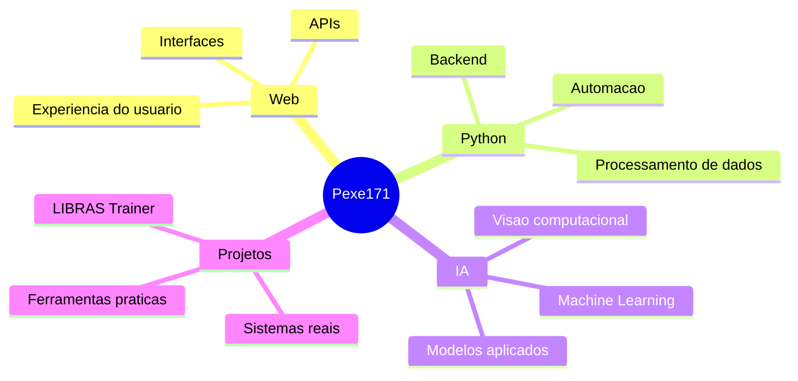

<h1 align="center">Olá, eu sou o Pexe171</h1>

<p align="center">
  Desenvolvedor focado em criar projetos práticos com <strong>web</strong>, <strong>IA</strong>, <strong>visão computacional</strong> e <strong>machine learning</strong>.
</p>

<p align="center">
  <a href="https://github.com/Pexe171?tab=repositories">
    
  </a>
  <a href="https://github.com/Pexe171/libras-trainer">
    
  </a>
</p>

---

## Sobre mim

Estou construindo projetos reais para aprender, testar ideias e transformar tecnologia em soluções úteis. Meu foco atual está em:

- desenvolvimento web com JavaScript, TypeScript, HTML e CSS
- aplicações Python para automação, backend e visão computacional
- projetos com IA, machine learning e processamento de imagem
- sistemas que conectam interface, câmera, dados e modelos de aprendizado

Gosto de trabalhar em projetos que saem do básico: coletar dados, treinar modelos, criar interface, testar em ambiente real e melhorar com base no uso.

---

## Projeto em destaque

### [LIBRAS Trainer](https://github.com/Pexe171/libras-trainer)

Sistema web para coletar dados, treinar modelos e reconhecer letras do alfabeto em LIBRAS usando câmera, MediaPipe, OpenCV, Flask e scikit-learn.

O projeto trabalha com um pipeline completo:

```text
Câmera
  -> MediaPipe Hands
  -> 21 landmarks da mão
  -> 63 features
  -> modelo de machine learning
  -> letra reconhecida
```

Principais pontos:

- interface web para coleta e reconhecimento
- leitura de câmera via RTSP
- extração de landmarks com MediaPipe Hands
- treino com Random Forest e benchmark com outros modelos
- dataset em JSON/CSV
- explicação do fluxo de aprendizado e validação

Repositório:

[github.com/Pexe171/libras-trainer](https://github.com/Pexe171/libras-trainer)

---

## Tecnologias

### Linguagens


### Ferramentas e áreas


```text
Web
  -> interfaces, APIs e experiências práticas

Python
  -> automação, backend, visão computacional e ML

IA e ML
  -> coleta de dados, treino, avaliação e uso em tempo real
```

---

## O que estou explorando agora

- sistemas web com integração em tempo real
- visão computacional aplicada a câmera
- modelos de machine learning com dados próprios
- boas práticas de documentação e versionamento
- automações para acelerar desenvolvimento

---

## GitHub Stats

<p align="center">
  
  
</p>

---

## Mapa mental do meu foco



---

## Contato

Você pode acompanhar meus projetos por aqui:

[github.com/Pexe171](https://github.com/Pexe171)

---

<p align="center">
  Construindo, testando e melhorando um projeto por vez.
</p>
